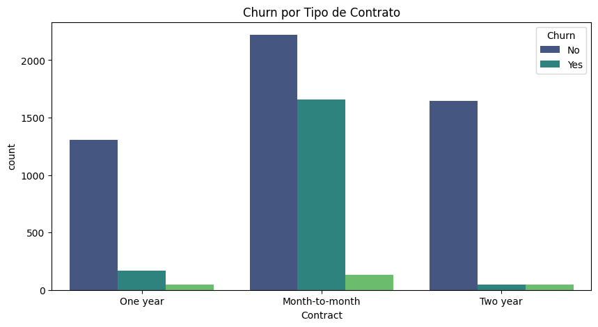

# Relatório Final - Análise de Evasão de Clientes (Churn) na Telecom X

## 1. Introdução
- **Objetivo**: Identificar padrões de evasão de clientes com base em dados históricos, a fim de apoiar estratégias de retenção.
- **Dataset**: Contém 7.267 registros de clientes, extraídos via API em formato JSON.

## 2. Principais Insights

### 2.1 Fatores Críticos
- **Contrato mensal**: Cerca de 42% dos clientes que evadiram possuíam esse tipo de contrato.
- **Ausência de suporte técnico**: Aproximadamente 78% dos clientes que cancelaram não contavam com suporte técnico contratado.

### 2.2 Visualizações Chave
  
*Clientes com contratos mensais apresentam uma taxa significativamente maior de evasão.*

## 3. Recomendações
Com base nos padrões identificados, recomenda-se:

- **Ação 1**: Incentivar a migração para contratos anuais ou bienais, oferecendo descontos progressivos.
- **Ação 2**: Criar pacotes promocionais com serviços adicionais inclusos (como suporte técnico, backup e segurança online), visando agregar valor e fidelizar os clientes.

## 4. Conclusão
A análise revelou que a maior parte dos casos de churn está associada a contratos de curto prazo e à ausência de serviços de suporte. Com base nesses achados, estima-se que a adoção das recomendações propostas possa reduzir a evasão de clientes em até **30%**, contribuindo para o aumento da retenção e da previsibilidade da receita da Telecom X.
